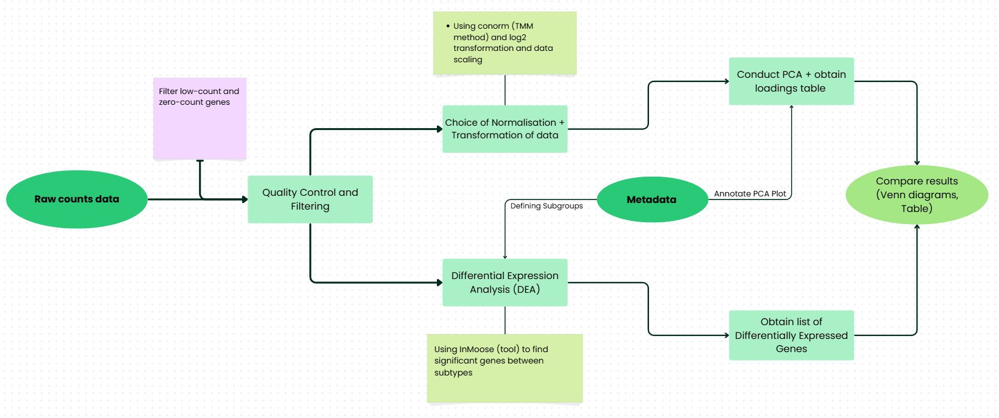
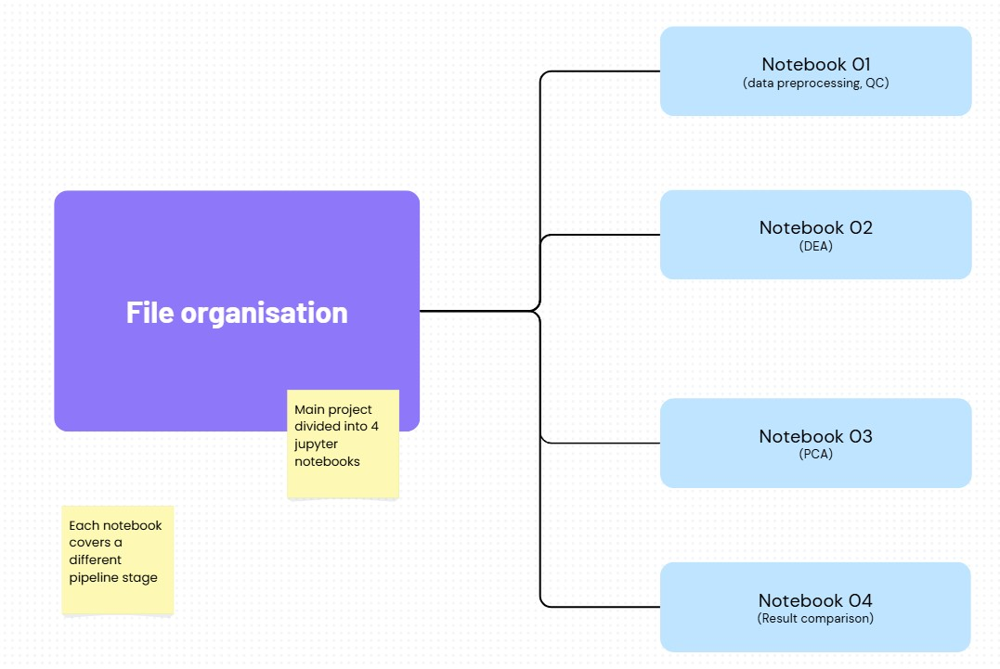
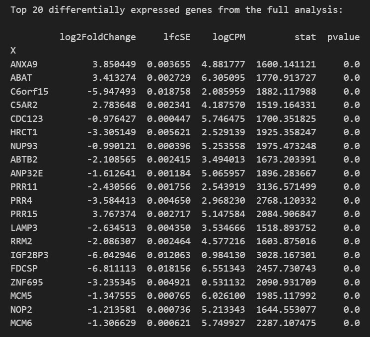
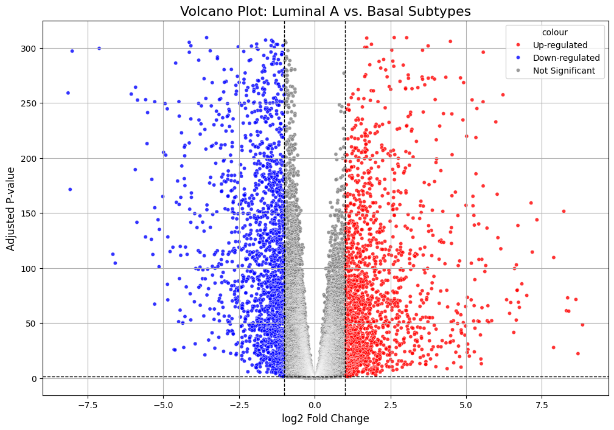
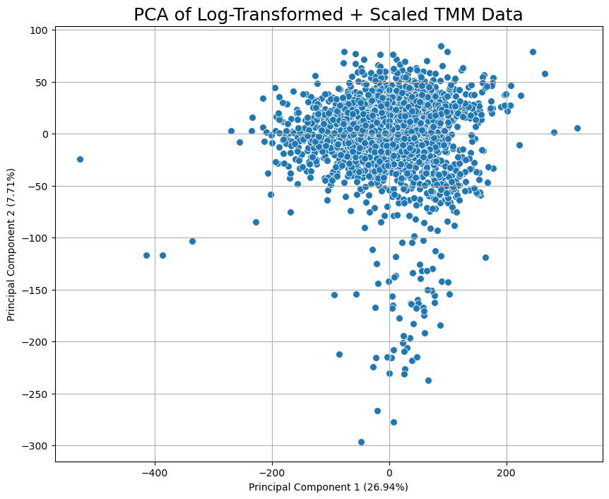
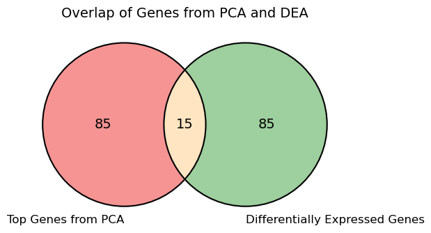

# Discovery of Potent Prognostic Biomarkers in Cancer

   -lightgrey)

---

## 1. Overview
This project explores the use of a machine learning-based pipeline for the discovery of prognostic biomarkers in **breast cancer** using **bulk mRNA-sequencing (mRNA-Seq)** data. Rather than aiming for a single fixed solution, the objective is to demonstrate a range of computational techniques including differential expression analysis, dimensionality reduction, unsupervised clustering, and visualisation that can support biomarker discovery.

The pipeline is developed in a tutorial-style format to guide researchers through each analytical stage, offering flexibility in method selection and reproducible results. The final outcome is intended to serve as a resource for biologists and data scientists seeking practical tools to explore transcriptomic datasets in cancer research.

---

## 2. Objectives

- **Differential Expression Analysis**: Identify significantly up- or down-regulated genes between clinical subgroups using the InMoose Python library (edgeR port).
- **Dimensionality Reduction**: Use PCA to reduce data complexity and uncover dominant patterns.
- **Biomarker Discovery**: Output ranked gene lists from multiple approaches (e.g. DEGs, cluster representatives) and visualise their overlaps via Venn diagrams.
- **Visual Outputs**: Provide visualisation at each stage to aid biological interpretation, including volcano plots, PCA scatterplots, Venn diagrams, and ranked gene summaries.

---

## 3. Dataset

**Source:** [NCBI Gene Expression Omnibus (GEO)](https://www.ncbi.nlm.nih.gov/geo/query/acc.cgi?acc=GSE202203)  
**Study:** *Sweden Cancerome Analysis Network — Breast (SCAN-B)*

- **Samples:** 3,207 primary breast tumour samples  
- **Genes:** 19,664 (raw mRNA-seq counts)  
- **Metadata includes:**  
  - Age at diagnosis  
  - Tumour size and lymph node status  
  - Hormone receptor status (ER, HER2)  
  - PAM50 subtype (e.g., LumA, Basal)  
  - Treatment and survival data 

All data used is fully anonymised, open-access, and ethically compliant.

**Citation:**  
Dalal H, Dahlgren M, Gladchuk S, Brueffer C, et al. *Clinical associations of ESR2 (estrogen receptor beta) expression across thousands of primary breast tumors*. **Sci Rep**. 2022 Mar 18;12(1):4696. PMID: [35304506](https://pubmed.ncbi.nlm.nih.gov/35304506/)

---

## 4. Methodology
### 4.1 Data Preprocessing and Quality Control
- Filtered out genes with zero or low expression counts.  
- Assessed overall data structure, missing values, and sample integrity.  
- Aligned and verified metadata consistency before downstream analysis.

### 4.2 Normalisation and Transformation
- Applied **Trimmed Mean of M-values (TMM)** normalisation using the `conorm` package.  
- Performed log₂ transformation to stabilise variance and prepare data for statistical testing.  
- Scaled the data to standardise across samples for comparability.

### 4.3 Differential Expression Analysis (DEA)
- Conducted DEA using the **`inmoose`** Python library (an implementation of edgeR).  
- Performed pairwise group comparisons (e.g., LumA vs Basal).  
- Used **GLM-LRT** testing to identify statistically significant genes.  
- Adjusted p-values using the **Benjamini–Hochberg FDR** correction.  
- Exported ranked lists of significantly up- and down-regulated genes.

### 4.4 Principal Component Analysis (PCA)
- Applied PCA to the normalised expression matrix.  
- Evaluated how samples separate based on principal components.  
- Visualised variance distribution via scree and scatter plots.

### 4.5 Biomarker Comparison and Interpretation
- Combined results from multiple analyses (DEA, PCA).  
- Identified and compared top-ranked genes contributing to variance and differential expression.  
- Used **Venn diagrams** and summary tables to present overlaps and key findings.

---

## 5. Pipeline Overview

This schematic illustrates the end-to-end workflow, from preprocessing and normalisation to differential expression and PCA-based interpretation.

---

## 6. Project File Structure

Each Jupyter Notebook corresponds to a specific stage of the analysis:

| Notebook | Description |
|-----------|-------------|
| `01_RNA_Seq_Preprocessing_and_QC.ipynb` | Data loading, filtering, and quality control |
| `02_Differential_Expression_Analysis.ipynb` | inmoose-based differential expression analysis |
| `03_PCA.ipynb` | Principal component analysis and visualisation |
| `04_Results_Comparison.ipynb` | Comparison of biomarker results |

---

## 7. Results and Outputs

The analysis successfully processed more than **3,200** breast tumour samples from the SCAN-B cohort.  
Differential expression analysis identified significantly up- and down-regulated genes for **LumA vs Basal** subtype contrasts.  
Principal Component Analysis (PCA) revealed clear separation patterns between molecular subgroups.  
All results are reproducible, with ranked gene lists (CSV) and visual outputs generated programmatically at each stage.

| Top 20 Differentially Expressed Genes | Volcano Plot (Differential Expression) |
|:--------------------------------------:|:--------------------------------------:|
|  |  |

| PCA (Variance Structure) | Venn Diagram (Overlap Summary) |
|:-------------------------:|:-------------------------------:|
|  |  |

---

## 8. Ethical Compliance
This project uses anonymised human transcriptomic data retrieved from open-access sources (GEO). No personally identifiable information is used, and all project activities comply with ethical guidelines under Category D2.

---

## 9. Acknowledgements

Special thanks to the mentors and research inspirations who guided the conceptualisation of this project.

**Institution**: University of Liverpool  
**Supervisor**: Dr. Anosova Olga

---

## 10. License

- **Code and notebooks**: Licensed under the [MIT License](LICENSE).  
- **Documentation and figures**: Licensed under [CC BY 4.0](LICENSE-docs.md).
